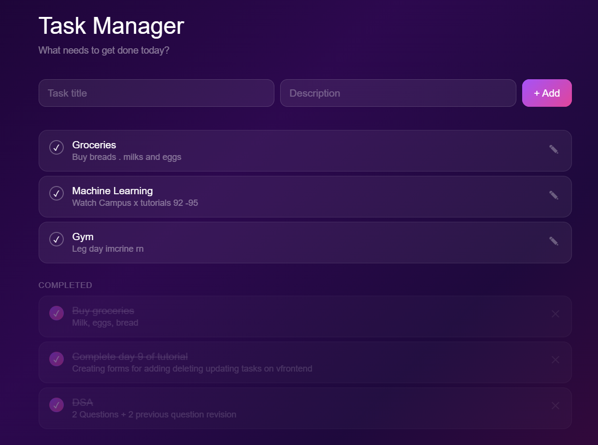
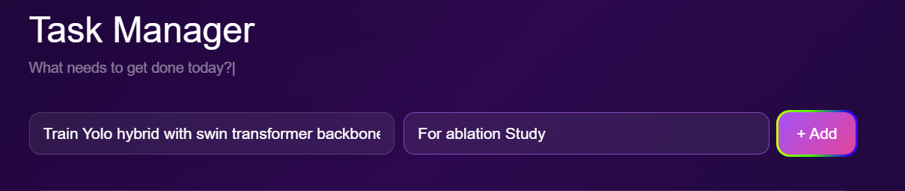
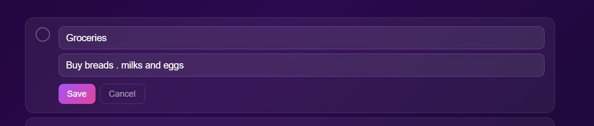
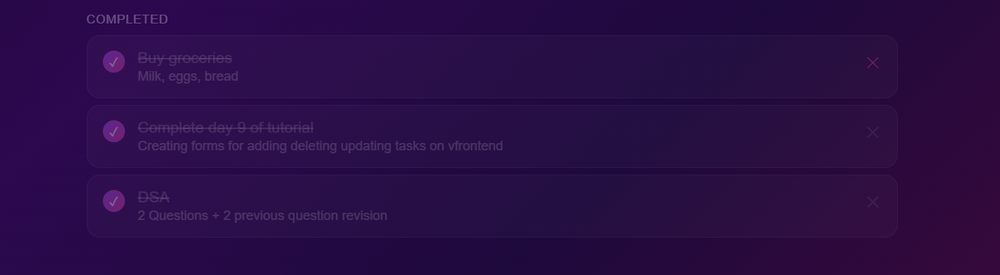
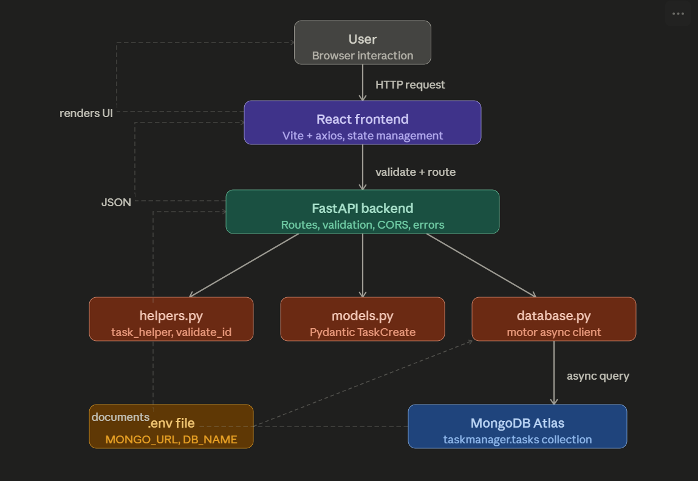
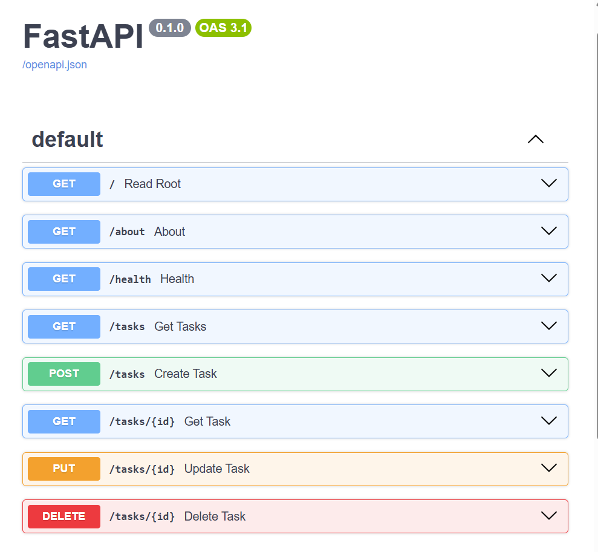

# My First CRUD App — Task Manager

> This is the most basic CRUD application you can build — a task manager.
> The entire point of this project is to learn how data flows: from a browser input, through a React component, over HTTP to a Python API, into a NoSQL database, and back again. There are no shortcuts, no magic frameworks hiding the wiring. Every layer is exposed on purpose.

---

## What It Does

A minimal task manager where you can:

- **Create** a task with a title and optional description
- **Read** all tasks (split into active and completed)
- **Update** a task — edit its title/description, or mark it as done
- **Delete** a task once it is completed

When you mark a task done, a confetti burst plays and the card fades into the "Completed" section. When you delete it from there, it's gone from the database.

---

## Screenshots

### Full App View


### Adding a Task


### Editing a Task


### Deleting a Task



---

## Data Flow Diagram



---

## Tech Stack

| Layer | Technology | Why |
|---|---|---|
| Frontend | React 19 + Vite | Component state drives the UI; Vite gives instant hot-reload |
| HTTP Client | Axios | Cleaner than `fetch` for REST calls; auto JSON parsing |
| Backend | FastAPI (Python) | Async-native, auto-generates `/docs`, minimal boilerplate |
| Validation | Pydantic v2 | Enforces schema on every incoming request body |
| Database | MongoDB Atlas | Schema-free, good fit for a simple document like a task |
| DB Driver | Motor (async) | Async MongoDB driver — matches FastAPI's async model |
| CORS | FastAPI middleware | Allows the Vite dev server (port 5173) to talk to the API (port 8000) |

---

## Project Structure

```
My_First_CrudApp/
│
├── backend/
│   ├── main.py          # FastAPI app — all five routes live here
│   ├── models.py        # Pydantic schema: TaskCreate (title, description, done)
│   ├── database.py      # Motor client connecting to MongoDB Atlas
│   └── helper.py        # task_helper() serialises Mongo docs; validate_object_id()
│
├── task-frontend/
│   ├── src/
│   │   ├── App.jsx      # Single component — all state, all API calls, all UI
│   │   ├── App.css      # Styling (dark theme, animations, canvas background)
│   │   └── main.jsx     # React entry point
│   ├── index.html
│   ├── vite.config.js
│   └── package.json
│
├── assets/              # Screenshots and DFD used in this README
├── .env                 # MONGO_URL and DB_NAME (not committed)
├── requirements.txt     # Python dependencies
└── crud/                # Python virtual environment
```

---

## Full Request Lifecycle

Here is exactly what happens when you click **+ Add** to create a task.

```
1. BROWSER (React state)
   User types a title → React updates `title` state via onChange
   User clicks "+ Add" → createTask() is called

2. HTTP REQUEST (Axios)
   axios.post("http://localhost:8000/tasks", { title, description, done: false })
   → Sends a POST request with a JSON body to the FastAPI server

3. CORS CHECK (FastAPI middleware)
   The server checks the Origin header.
   "http://localhost:5173" is in the allow_origins list → request is allowed.

4. ROUTE HANDLER (main.py)
   @app.post("/tasks") fires.
   FastAPI reads the JSON body and passes it to Pydantic.

5. VALIDATION (Pydantic / models.py)
   TaskCreate parses the body.
   If `title` is missing or the wrong type → 422 Unprocessable Entity is returned immediately.
   If valid → a clean Python dict is produced via task.model_dump()

6. DATABASE WRITE (Motor / database.py)
   tasks_collection.insert_one(task.model_dump())
   Motor sends the document to MongoDB Atlas over TLS.
   MongoDB stores it and returns the new _id (an ObjectId).

7. DATABASE READ (confirming the insert)
   tasks_collection.find_one({"_id": new_task.inserted_id})
   The freshly inserted document is fetched back so we can return it.

8. SERIALISATION (helper.py)
   task_helper(created) converts ObjectId → string id
   and returns a plain dict: { id, title, description, done }

9. HTTP RESPONSE
   FastAPI serialises the dict to JSON and sends it back to Axios.
   Status 200 OK.

10. REACT STATE UPDATE
    The .then() callback runs: setTitle(""), setDescription(""), fetchTasks()
    fetchTasks() fires a GET /tasks, gets the full list, and updates state.
    React re-renders — the new task appears on screen.
```

The same pattern repeats for every operation:

| Action | HTTP Method | Route | What changes in DB |
|---|---|---|---|
| Load tasks | GET | `/tasks` | Nothing — read only |
| Get one task | GET | `/tasks/{id}` | Nothing — read only |
| Create task | POST | `/tasks` | `insert_one` |
| Edit task | PUT | `/tasks/{id}` | `update_one` with `$set` |
| Mark done | PUT | `/tasks/{id}` | `update_one` sets `done: true` |
| Delete task | DELETE | `/tasks/{id}` | `delete_one` |
### Swagger / Auto-generated API Docs


---

## Running Locally

### Prerequisites
- Python 3.10+
- Node.js 18+
- A MongoDB Atlas cluster (free tier is fine)

### Backend

```bash
# Create and activate the virtual environment
python -m venv crud
crud\Scripts\activate        # Windows
# source crud/bin/activate   # macOS/Linux

pip install -r requirements.txt
```

Create a `.env` file in the project root:

```
MONGO_URL=mongodb+srv://<user>:<password>@<cluster>.mongodb.net/
DB_NAME=taskdb
```

Start the server:

```bash
uvicorn backend.main:app --reload
# API running at http://localhost:8000
# Docs at     http://localhost:8000/docs
```

### Frontend

```bash
cd task-frontend
npm install
npm run dev
# App running at http://localhost:5173
```

---

## API Endpoints

| Method | Path | Description |
|---|---|---|
| GET | `/` | Health check — returns connection status and task count |
| GET | `/tasks` | List all tasks |
| POST | `/tasks` | Create a task `{ title, description?, done? }` |
| GET | `/tasks/{id}` | Get a single task by ID |
| PUT | `/tasks/{id}` | Update a task by ID |
| DELETE | `/tasks/{id}` | Delete a task by ID |

Interactive docs are auto-generated at `http://localhost:8000/docs` (Swagger UI).

---

## Key Concepts Illustrated

- **Separation of concerns** — frontend only handles display and user input; the backend owns all business logic and data persistence.
- **Async all the way down** — FastAPI routes are `async def`; Motor uses `await` for every DB call; nothing blocks the server thread.
- **Pydantic as a contract** — the `TaskCreate` model is the single source of truth for what a valid task looks like. It validates on the way in, not scattered across the codebase.
- **ObjectId serialisation** — MongoDB's `_id` is a BSON `ObjectId`, not a string. `task_helper()` converts it before it leaves the server so the frontend never has to know about BSON.
- **CORS** — browsers refuse cross-origin requests by default. The one middleware line in `main.py` is the entire reason the React app can talk to the Python server during development.
